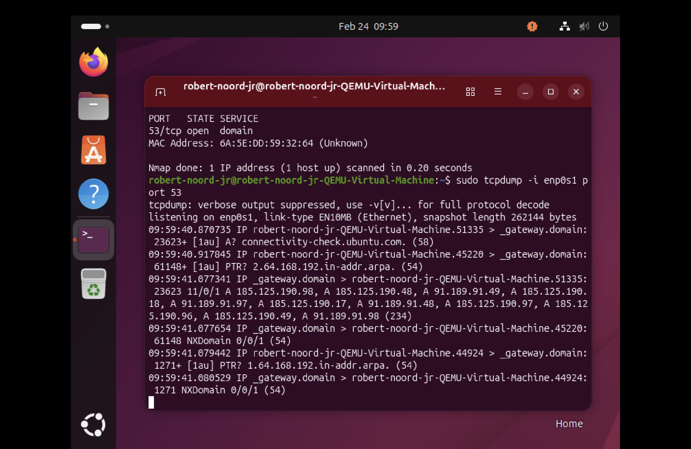
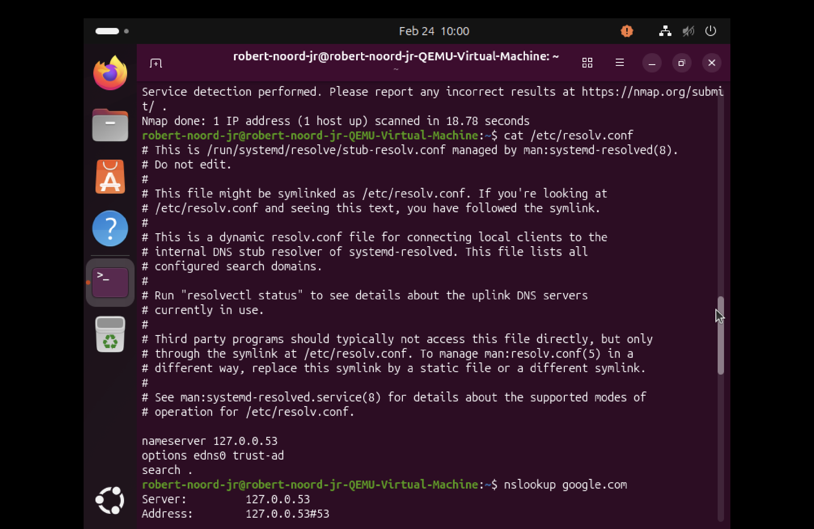

# Linux Static IP & Subnet Segmentation Lab

## 📌 Overview

This lab demonstrates manual IP configuration, subnet segmentation using CIDR notation, and validation of subnet boundaries within a Linux virtual machine environment.

The objective was to simulate multiple hosts within a smaller subnet (/28) inside a larger /24 network and verify routing behavior, broadcast boundaries, and scoped network scanning.

---

## 🖥 Environment

- OS: Ubuntu Linux (VM)
- Interface: `enp0s1`
- Base Network: `192.168.64.0/24`
- Tools Used:
  - `ip` (IP configuration)
  - `ping` (connectivity testing)
  - `nmap` (network scanning)
  - `ip route` (routing table analysis)

---

## 🎯 Objectives

- Manually assign static IP addresses
- Create a `/28` subnet inside an existing `/24`
- Identify network and broadcast addresses
- Validate subnet boundaries
- Perform subnet-scoped host discovery
- Analyze longest prefix match behavior

---

## 🔧 Step 1 — Assign Static IP Addresses

Three simulated hosts were created within a `/28` subnet:

```bash
sudo ip addr add 192.168.64.18/28 dev enp0s1
sudo ip addr add 192.168.64.19/28 dev enp0s1
sudo ip addr add 192.168.64.20/28 dev enp0s1
---

## 📸 Screenshots
### 2️⃣ Broadcast Address Validation

Attempting to ping the broadcast address verifies correct subnet boundary configuration.


### 3️⃣ Subnet-Scoped Nmap Scan

Targeted host discovery within the 192.168.64.16/28 subnet confirms proper segmentation and scoped visibility.



### 4️⃣ Routing Table (Longest Prefix Match)

The routing table demonstrates overlapping routes (/24 and /28), where Linux selects the most specific route using longest prefix match logic.


### 5️⃣ DNS Port Verification

Port 53 (DNS) scan confirms active DNS service and validates network communication to the gateway.



